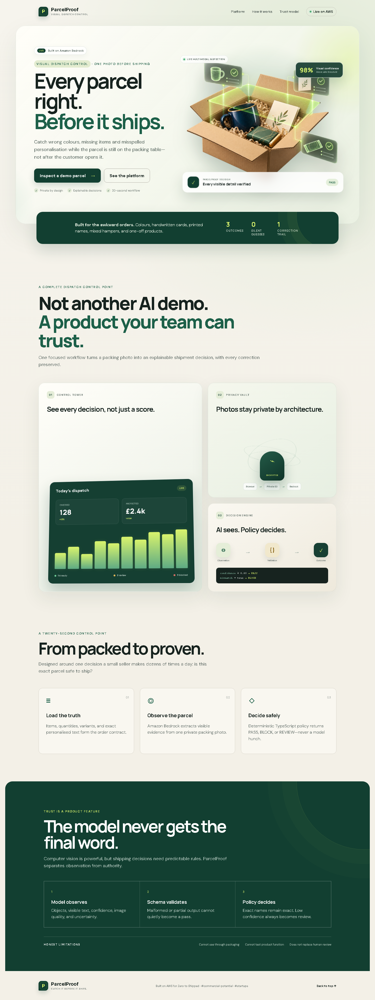
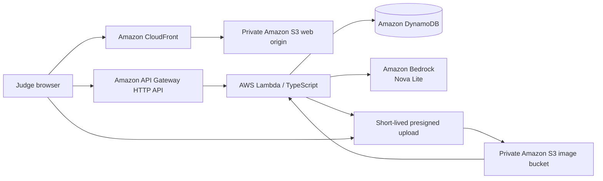

# ParcelProof

> Catch the wrong item before the parcel leaves the table.

ParcelProof is a visual dispatch-control workflow for small sellers of personalised and visually variable products. Amazon Bedrock observes a private packing photo; validated, deterministic TypeScript policy decides whether the parcel is safe to ship, must be blocked, or needs human review.

[Open the live AWS application](https://d1ia8x26lvtay4.cloudfront.net) · [Check API health](https://ebuk0g78lb.execute-api.us-east-1.amazonaws.com/health) · [View the evidence](EVIDENCE.md)



The current product also supports [custom order contracts](docs/evidence/product-v4-custom-order.png) and downloadable inspection reports.

## Try the judge demo

No account or setup is required.

1. Open the [live application](https://d1ia8x26lvtay4.cloudfront.net).
2. Select **Inspect a demo parcel** to load the blue mug, chocolate bar, greeting card, and exact `Happy Birthday Ayesha` requirement, or choose **Create custom order** to define your own contract.
3. Choose one of the included realistic synthetic demo photos, or upload a JPG, PNG, or WebP packing photo (maximum 8 MB).
4. Review the evidence-backed `PASS`, `REVIEW`, or `BLOCK` result.
5. If blocked, correct the parcel and inspect again; the recovery trail remains in the order history.

The interface clearly states the product boundary: ParcelProof verifies only visible evidence. It cannot see through sealed packaging or test whether a product functions.

## Why this is different

Barcode systems work well for standard inventory, but a barcode cannot confirm that a mug is blue, the printed name is Ayesha rather than Alisha, or the handwritten card has the correct message. ParcelProof targets that last visual control point for small sellers who cannot justify warehouse-grade hardware.

The key trust boundary is intentionally simple:

> The model observes. Deterministic policy decides.

Amazon Bedrock never returns the shipping verdict. It returns structured observations about visible items, variants, quantities, text, image quality, confidence, and uncertainty. Zod validates that payload. Policy code then applies a configurable `0.85` confidence threshold and exact normalised text matching:

- `PASS` only when every visible requirement is confidently satisfied.
- `BLOCK` for confident item, quantity, variant, or personalisation contradictions.
- `REVIEW` for ambiguity, low confidence, poor image quality, invalid model output, or service failure.

## AWS architecture



| AWS service | Role |
| --- | --- |
| Amazon CloudFront | Public HTTPS product and judge URL |
| Amazon S3 | Private static origin and private packing-photo storage |
| Amazon API Gateway | Throttled public HTTP API |
| AWS Lambda | Order, upload, inspection, and history orchestration |
| Amazon Bedrock | Real multimodal observation with Amazon Nova Lite |
| Amazon DynamoDB | Orders and chronological inspection history |
| Amazon CloudFormation / CDK | Reproducible infrastructure as code |
| Amazon CloudWatch | Runtime logs and operational visibility |

## Security and privacy

- Both S3 buckets block public access and use server-side encryption.
- Packing images upload through five-minute presigned URLs and expire automatically after 14 days.
- File type and size are checked in the browser and again before inference.
- Lambda has scoped permissions for the exact table, image bucket, and Bedrock model it needs.
- Demo aliases are used instead of real customer data.
- No AWS credentials, account identifiers, raw image data, or secret values are published.
- API throttling and conservative limits protect the public demo.

## Evidence and evaluation

The repository contains a provenance-labelled 12-image synthetic dataset spanning personalised gifts, beauty, apparel, baby gifts, wedding favours, pet accessories, stationery, jewellery, and seasonal products. It includes expected `PASS`, `BLOCK`, and `REVIEW` cases, but it is not presented as a general accuracy benchmark.

Verified evidence includes:

- A redacted read-only AWS MCP connection and Bedrock model-discovery record.
- A real production `BLOCK`, corrected `PASS`, and retained inspection history.
- An earlier malformed/uncertain model response safely routed to `REVIEW`.
- 12 automated unit, API, and infrastructure tests.
- A Playwright production smoke test for the no-login judge flow.
- Desktop and 390 px mobile visual verification.

See the stable [evidence entry point](EVIDENCE.md), [complete evidence index](docs/evidence/EVIDENCE_INDEX.md), [dated live fixture evaluation](docs/evidence/public-demo-live-results.md), [build log](BUILD_LOG.md), and [synthetic dataset documentation](test-fixtures/synthetic/README.md). The three-case run proves the public scenarios behaved as intended at that time; it is not claimed as statistical model accuracy.

## Local development

Prerequisites: Node.js 20+ and npm.

```bash
npm install
npm run dev
```

The web app reads its deployed API URL from generated runtime configuration. Production AWS calls require appropriately configured AWS credentials; never commit them.

## Quality gates

```bash
npm run lint
npm run typecheck
npm test
npm run test:data
npm run build
npm run cdk:synth
npm run test:e2e
```

`npm run test:e2e` targets the deployed product and therefore requires network access.

## Deployment

The application is defined as one AWS CDK v2 stack in `infrastructure/`.

```bash
npm run cdk:synth
npm run deploy
```

Deployment uses the configured AWS identity and Region. The production stack is intentionally preserved through judging.

## Known limitations

- A single photograph cannot prove an obscured or sealed item is present.
- The system does not verify weight, product function, authenticity, or damage outside the frame.
- The `0.85` threshold is a configurable MVP guardrail, not a scientifically calibrated score.
- The synthetic fixture set is useful regression material, not evidence of broad real-world accuracy.
- Human review remains the safe outcome whenever evidence is insufficient.

## Built with an AWS-connected coding agent

Codex used the official AWS MCP connection for redacted, read-only identity verification and Bedrock model discovery before deployment work. It then helped implement CDK infrastructure, diagnose deployment and signed-upload failures, run quality gates, and preserve factual evidence. See [AWS MCP connection evidence](docs/evidence/aws-mcp-connection.md) and the timestamped [build log](BUILD_LOG.md).

## Submission

The prepared Builder Center copy, cover artwork, demo script, and final publish checklist live in [`docs/submission`](docs/submission/). The Builder Center project URL will be added here after publication.

## License

Licensed under the terms in [LICENSE](LICENSE).
